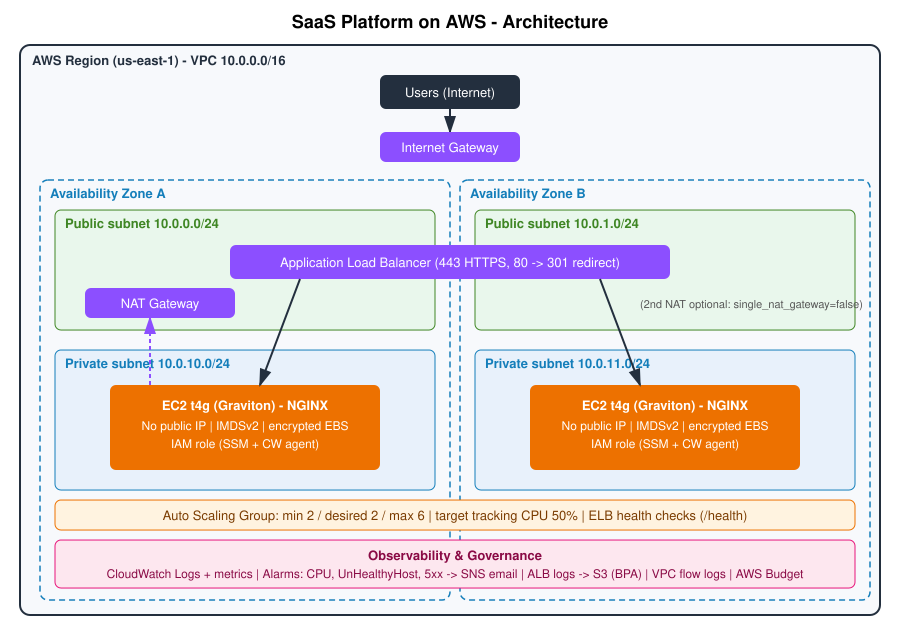

# Production-Ready SaaS Platform on AWS (Terraform)

Highly available, secure, automated, scalable and cost-aware AWS infrastructure for a SaaS web app.
Everything is provisioned with modular Terraform; CI/CD runs on GitHub Actions using OIDC (no AWS keys).



```
Internet -> IGW -> ALB (public subnets, 2 AZ) -> ASG of EC2 t4g/NGINX (private subnets, 2 AZ)
                                                  \-> NAT GW -> internet (patches, SSM, CloudWatch)
```

## Repository layout
```
main.tf variables.tf outputs.tf versions.tf backend.tf    # root composition
modules/network        VPC, 2 public + 2 private subnets, IGW, NAT, route tables, S3 endpoint, flow logs
modules/security       Security groups (least privilege)
modules/alb            ALB, HTTPS + HTTP->HTTPS redirect, target group, ACM cert, S3 access-log bucket
modules/compute        IAM role, launch template (Graviton, encrypted EBS, IMDSv2), ASG, scaling policy
modules/observability  SNS topic, CPU / unhealthy-host / 5xx alarms
modules/budget         AWS Budget with 80% actual + 100% forecast alerts
bootstrap/             One-time S3 bucket for remote Terraform state
.github/workflows/     terraform-ci.yml (fmt, validate, tflint, checkov, gitleaks, plan, gated apply)
docs/                  architecture.svg, production-readiness.md
```

## a) Deployment steps
Prereqs: Terraform >= 1.10, AWS CLI configured (SSO/role, not static keys), an email address for alerts.

```bash
# 1. (once) create the remote-state bucket
cd bootstrap && terraform init && terraform apply && cd ..

# 2. configure
cp terraform.tfvars.example terraform.tfvars      # set alert_email (git-ignored)

# 3. deploy
terraform init \
  -backend-config="bucket=<state_bucket_from_step_1>" \
  -backend-config="key=saas/prod/terraform.tfstate" \
  -backend-config="region=us-east-1" \
  -backend-config="use_lockfile=true"
terraform plan -out tfplan
terraform apply tfplan

# 4. verify
curl -k https://$(terraform output -raw alb_dns_name)     # -k only for the self-signed demo cert
```
Then confirm the SNS subscription and AWS Budgets emails. Refresh the page a few times: the instance ID changes, proving load balancing across AZs.
Tear down: `terraform destroy`.

**CI/CD setup:** create an IAM OIDC provider for GitHub and a role trusted for this repo; add repo secret `AWS_ROLE_ARN`, repo variables `TF_STATE_BUCKET` and `ALERT_EMAIL`, and add required reviewers on the `production` GitHub Environment.
PRs run fmt/validate/lint/scan/plan; merging to `main` runs apply after manual approval.

## b) Architecture decisions
| Decision | Why |
|---|---|
| 2 AZs, ALB + ASG spanning both | Survives an AZ failure; min 2 instances means one per AZ |
| EC2 in private subnets, ALB only public | Smallest internet-facing surface |
| Graviton `t4g.micro`, AL2023 arm64 | ~20% cheaper than x86 equivalents, better price/performance |
| ASG `health_check_type = ELB` | Instances failing the app health check are replaced automatically |
| SSM Session Manager, no SSH, no key pairs | No inbound admin port, no keys to leak, audited sessions |
| Self-signed cert by default | Lets the stack deploy HTTPS with no domain. Pass `certificate_arn` for a real ACM cert |
| Single NAT by default (`single_nat_gateway=true`) | NAT is the largest fixed cost; flip to `false` for per-AZ egress resilience |
| Modular Terraform + remote S3 state with locking | Reusable, reviewable, safe for team/CI use |
| OIDC for CI | No long-lived credentials anywhere |

## c) Cost estimate (us-east-1, on-demand, approximate monthly)
| Item | Est. USD |
|---|---|
| 2 x t4g.micro EC2 (730h) | 12.3 |
| 2 x 8 GB gp3 EBS | 1.3 |
| 1 NAT Gateway (+ ~10 GB data) | 33.3 |
| ALB (hours + minimal LCU) | 22.0 |
| Public IPv4 addresses (ALB x2, NAT EIP) | 11.0 |
| CloudWatch (logs, alarms, custom metrics) | 3.0 |
| S3 logs, flow logs, SNS, Budgets | 1.0 |
| **Total** | **about $84 / month** |

Prices vary by region and change over time; confirm with the AWS Pricing Calculator. Budget default is $100/month with alerts at 80% actual and 100% forecast.

**Optimization recommendations**
- **Graviton** (already used): ~20% lower than comparable x86.
- **Compute Savings Plan** (1-yr, no upfront) once load is stable: commonly 20-30% off EC2.
- **Right-size** from CloudWatch CPU/memory data (t4g.nano/small, or fewer instances off-peak).
- **NAT**: biggest line item. Keep a single NAT for non-prod; add VPC interface endpoints (SSM, CloudWatch) if NAT data grows; the free S3 gateway endpoint is already configured.
- **Non-prod**: scheduled scale-to-zero nights/weekends, Spot instances for stateless workers.
- **Logs**: 30-day retention, ALB logs tier to IA after 30 d and expire at 90 d, flow logs REJECT-only.
- Cost allocation tags (`Project`, `Environment`) are applied to everything via provider `default_tags`.

## d) Security measures
| Requirement | Implementation |
|---|---|
| No public EC2 | Instances in private subnets; `associate_public_ip_address = false`; app SG only accepts traffic from the ALB SG |
| Block Public Access for S3 | All four BPA settings on the ALB log bucket (and state bucket); TLS-only bucket policy; SSE; lifecycle |
| IAM roles, no static keys | EC2 instance profile (SSM + CloudWatch agent only); CI uses GitHub OIDC |
| Encrypted EBS | `encrypted = true` on the launch-template root volume |
| HTTPS listener | ALB 443 with TLS 1.3/1.2 policy; port 80 returns 301 to HTTPS |
| No secrets in repo | `.gitignore` (tfvars, keys, state), gitleaks in CI, no credentials in code |
| Least-privilege SGs | ALB egress only to app SG; app egress only 443; no SSH |
| Extras | IMDSv2 required, ALB drops invalid headers, VPC flow logs (rejects), Checkov scan |

## e) Scaling strategy
- **Horizontal**: ASG min 2 / max 6, target tracking on average CPU 50%. Scale-out is automatic; ALB spreads load across both AZs.
- **Self-healing**: ELB health checks (`/health`, 15 s interval) replace failed instances; CloudWatch alarm notifies on unhealthy hosts.
- **Deployments**: launch-template changes trigger a rolling instance refresh (min 50% healthy).
- **Next steps for growth**: switch the policy to `ALBRequestCountPerTarget`, add CloudFront + WAF, RDS Multi-AZ / ElastiCache in the private tier (separate DB subnets), per-AZ NAT, and a pre-baked AMI for faster scale-out.

## Observability
- CloudWatch Logs: NGINX access/error logs (`/<name>/nginx`), VPC flow logs; ALB access logs in S3.
- Metrics: EC2/ALB default metrics plus agent memory and disk.
- Alarms (SNS email): **high CPU**, **unhealthy hosts**, ALB 5xx.

## Known limitations
- Demo self-signed certificate until a real `certificate_arn` is supplied.
- Not validated in this authoring environment (no Terraform/AWS access here): run `terraform validate` and `plan` before relying on it.
- Sample app is static NGINX; no database tier included.
